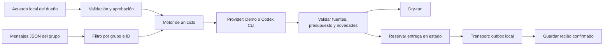

# Arquitectura de la base local

## Componentes

- model.ts: tipos y validación en tiempo de ejecución.
- engine.ts: planificar sin mutar; reservar antes de entregar; confirmar después.
- providers.ts: demo sintética y ejecución opcional de la CLI oficial.
- storage.ts: JSON local con escritura por rename, lock de proceso y outbox idempotente.
- cli.ts: una sola ejecución, status, approve, pause y terminate.

Node >=22, TypeScript estricto, cero dependencias de runtime. Los tests usan el runner de Node y fixtures sintéticas. Codex y Transport son interfaces; no se carga código arbitrario desde la configuración.

## Confianza y privacidad

El dueño configura el acuerdo desde la instalación local. Chat, web y salida del modelo son datos no confiables. El motor aplica presupuesto, moneda, dominios permitidos, grupo, frecuencia y aprobación fuera del modelo. No hay acciones de compra, reserva o contacto.

Codex recibe preferencias/objetivo, mensajes nuevos del grupo seleccionado y los 30 hallazgos más recientes. Nunca se envían credenciales de WhatsApp. Aunque no se copien tokens, Codex reutiliza su propia sesión oficial. En modo real el contenido sale de la máquina hacia el proveedor: requiere consentimiento.

El subprocess usa argumento-vector sin shell, prompt por stdin, cwd temporal privado, salida JSON validada, timeout de tres minutos y flags de aislamiento. No hereda API keys ni variables de secretos ajenos. No carga configuración personal y pide deshabilitar shell, apps y plugins. Una versión incompatible debe fallar; no hay degradación a permisos amplios. Este diseño no es una certificación de aislamiento frente a toda configuración gestionada o cambio de CLI. Revisa las capacidades de la versión instalada antes de usar chats reales.

`sourceHosts` limita los enlaces admitidos, no todos los sitios que podría visitar la búsqueda web. La calidad y veracidad se revisan por humanos. Un enlace permitido no garantiza que el precio o disponibilidad sea correcto.

## Estado y fallos

Cada grupo necesita su propio directorio. El estado guarda aprobación/digest, estado de control, última ejecución, IDs consumidos, hallazgos y reserva pendiente. Archivos nuevos privados (directorio 0700, archivos 0600); esos permisos no convierten una carpeta sincronizada o compartida en privada.

El lock evita ciclos concurrentes por CLI. Un crash puede dejar un lock manualmente recuperable. La escritura usa rename para evitar JSON parcialmente escrito; no ofrece garantías de fsync ante pérdida eléctrica.

Antes del envío se guarda `pending`, historial e IDs. Si el transporte reconoce la entrega, se limpia la reserva. Si falla o el proceso cae entre ambos pasos, otro ciclo se bloquea y requiere conciliación manual. Se prioriza evitar repetición: puede quedar una novedad sin entregar. No se promete exactly-once en WhatsApp.

Un ciclo sin hallazgos actualiza el checkpoint sin producir un mensaje. Los fallos del proveedor o de validación no actualizan un checkpoint exitoso. Se vuelve a investigar al vencer la frecuencia incluso si no hay nuevos mensajes, para detectar cambios de la web.

La deduplicación usa URL canónica, precio y moneda. Elimina fragmentos y parámetros comunes de tracking. Una misma oferta en dos URLs puede repetirse. Otro detalle al mismo URL/precio puede omitirse. Los límites de historial (1.000 hallazgos, 10.000 IDs) permiten que algo muy antiguo vuelva a aparecer.

No existe recolección incremental desde WhatsApp, extracción automática de preferencias, límite automático por fecha, scheduler ni UI web.

## Datos de ejemplo

apartments, travel y concerts usan IDs inventados y example.org. DemoProvider construye una opción ficticia al 80% del presupuesto; nunca interpreta mensajes como hechos reales ni ejecuta búsqueda web. El adaptador Codex se prueba con un ejecutable fake, no con una cuenta real.

## Próximos pasos pequeños

1. Revisar una investigación Codex real con contexto sintético y fuentes oficiales.
2. Implementar un transporte de prueba con captura/recibo, consentimientos y emparejamiento revisables.
3. Sólo entonces evaluar un scheduler de opt-in con duración, controles y métricas de cuota.

## Capa 0.2

private.ts valida home canónico fuera de Git/permisos; onboarding.ts guarda acuerdos/checkpoints/gaps; doctor.ts comprueba herramientas sin login. contribution.ts proyecta archivos elegidos a un bundle, privacy.ts escanea/redacta, maintainer.ts produce triage local desactivado y updates.ts cambia sólo código revisado.

La CLI usa locks por home. El publisher reescanea, verifica cuenta/base/target/fork público y reconstruye sólo el manifest sobre la base pública. No exporta historial local. Reserva antes de mutaciones remotas y bloquea replay incierto; conciliación aún manual. Cada permiso vincula bundle/source/target/cuenta y expira en diez minutos.

Patrones no detectan toda PII/secretos: términos privados y revisión humana son necesarios. Un home protegido no aísla de un proceso hostil con control de la cuenta local. El flag registra una respuesta humana obtenida por el agente, no prueba criptográficamente su identidad.

El recorrido usa directorios temporales, GitHub mock e inyección como datos. Adopción/rollback se prueban con Git temporal. No se requieren chats, QR, tokens, cron ni cuenta real.
